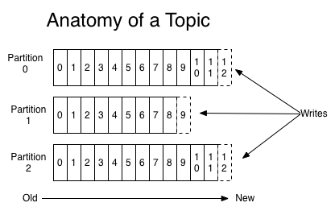
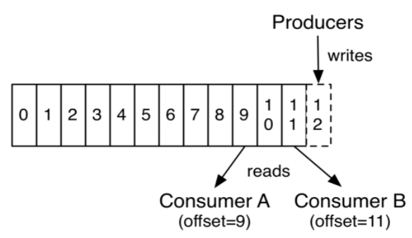

# Stock Streamer

## Kafka Streamer

[Kafka](https://kafka.apache.org/intro) is distributed streaming platform capable of handling trillions of events a day.

In simple words, it's a log file, an append-only system ordered by time. Every incoming record is appended to the end of the "file" (log) and consumers read this log.

### Topics

Records are published into topics and each topic can have on or more partitions. Each partition is an ordered and immutable sequence of events that is appended to. Every record in the partition is assigned a sequential id number called *offset* which uniquely identifies that record inside a partition.

### Retention

Kafka records are durable using a configurable retention period. For example, if the retention policy is set to two days, then for the two days after a record is published, it is available for consumption, after which it will be discarded to free up space.

Performance is effectively constant with respect to data size so storing data for a long time is not a problem. Kafka will perform the same whether you have 50 KB or 50 TB of persistent data on the server.

### Distributed

Partitions of a topic are distributed over the servers in a Kafka cluster, these are replicated to handle fault tolerance (configurable number of replicas).

### Kafka Producers

Producers publish data to topics. The producer is responsible to choose the partition in a topic where it wants to publish.

### Kafka Consumer

Consumers live in a *consumer group* and each record publish on a topic it's read by one consumer within this group.

